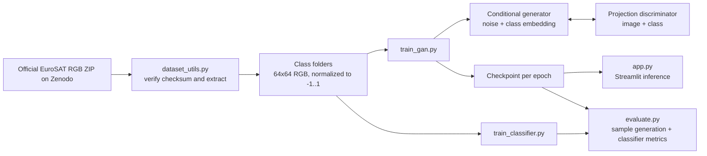

# System architecture

```mermaid
flowchart LR
  A[Official EuroSAT RGB ZIP on Zenodo] --> B[dataset_utils.py<br/>verify checksum and extract]
  B --> C[Class folders<br/>64x64 RGB, normalized to -1..1]
  C --> D[train_gan.py]
  D --> E[Conditional generator<br/>noise + class embedding]
  E <--> F[Projection discriminator<br/>image + class]
  D --> G[Checkpoint per epoch]
  G --> H[app.py<br/>Streamlit inference]
  G --> I[evaluate.py<br/>sample generation + classifier metrics]
  C --> J[train_classifier.py]
  J --> I
```

Training requires real EuroSAT images. The web application loads a saved generator checkpoint and produces its outputs at request time.

